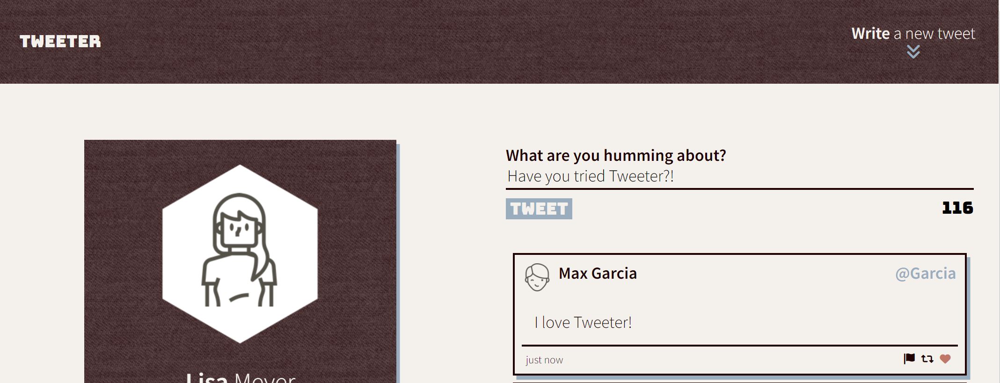
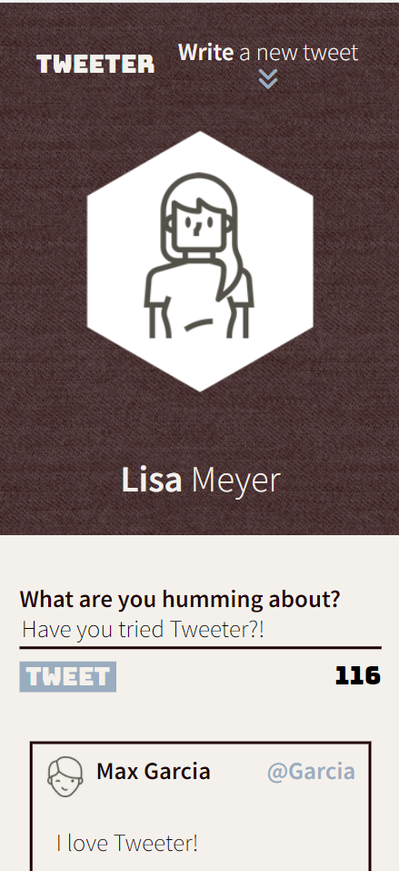
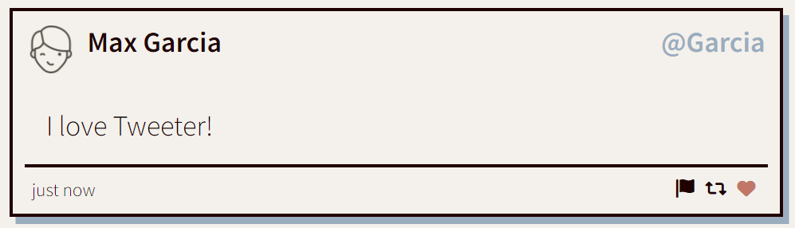
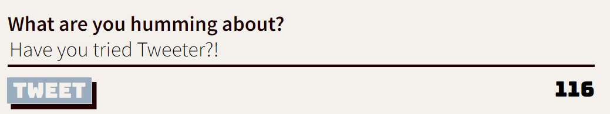

# Tweeter Project

Tweeter is a simple, responsive, single-page Twitter clone built with [HTML](https://developer.mozilla.org/en-US/docs/Web/HTML), [CSS](https://developer.mozilla.org/en-US/docs/Web/CSS), [JavaScript](https://developer.mozilla.org/en-US/docs/Web/JavaScript), [jQuery](https://jquery.com/), and [AJAX](https://developer.mozilla.org/en-US/docs/Web/Guide/AJAX).

## Purpose
**_BEWARE:_ This app was created for learning purposes. It is _not_ intended for use in production-grade software.**

This project was created and published by me as part of my learnings at Lighthouse Labs. Please note that the backend files related to this project were provided by Lighthouse Labs.

## Tweeter in Action
_Tweeter is a fully responsive web app and looks beautiful on both desktops and mobile devices!_



_The People love Tweeter!_



## Using Tweeter

### Setup
To set up Tweeter, ensure that you have Node.js installed then execute the following.

```
git clone git@github.com:l-m-meyer/tweeter.git
cd tweeter
npm install
```

## Development

### Directory Structure
```
./                      Main project directory
./public                Frontend documents
        /images
        /scripts
        /styles
        /vendor
./server                Backend documents
        /data-files
        /lib
        /routes
./docs                  Photos of Tweeter      
```

### Dependencies

* [express](https://www.npmjs.com/package/express)
* [body-parser](https://www.npmjs.com/package/body-parser)
* chance
* [md5](https://www.npmjs.com/package/md5)

### Development Dependencies
The following NPM packages are used:
* [nodemon](https://www.npmjs.com/package/nodemon)

### Run
It is preferred to use nodemon to automatically restart the server when files change while working on Tweeter.

Use this command:
```
npm run local
```
Then go to <http://localhost:8080/> in your browser.